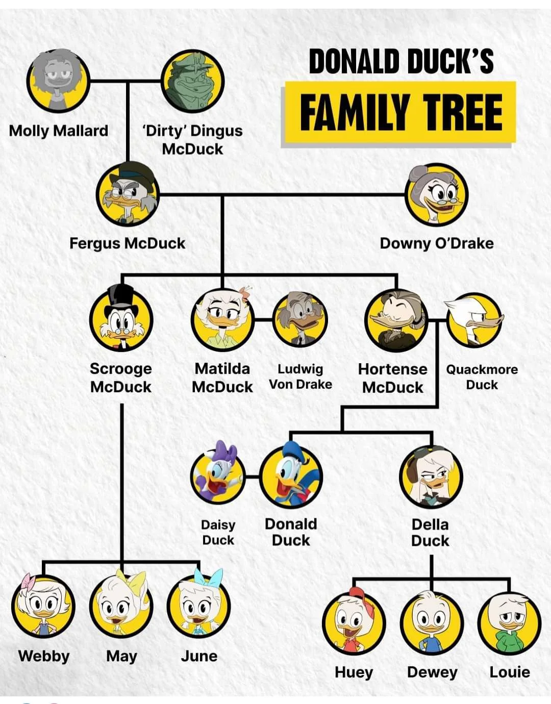

# UF1289 y UF1290

**Diseño de Elementos Software con Tecnologías basadas en Componentes**
**Implementación e Integración de Elementos Software con Tecnologías basadas en Componentes**

## Teoria -- Test (4 ptos)

*Cada acierto suma 0,5 puntos, cada error resta un acierto hasta un minimo de 0*

### 1. ¿Qué es una clase en JavaScript?

a) Un bloque de código que se ejecuta en segundo plano.
b) Una plantilla que define propiedades y métodos que los objetos creados a partir de ella pueden usar.
c) Un tipo de estructura de datos exclusiva para navegadores.
d) Una variable global que se puede acceder desde cualquier parte del código.

### 2. ¿Cómo se crea un objeto a partir de una clase en JavaScript?

a) `const objeto = crear Clase();`
b) `const objeto = Clase();`
c) `const objeto = new Clase();`
d) `const objeto = definir Clase();`

### 3. ¿Qué es el constructor en una clase de JavaScript?

a) Un método que se llama al destruir un objeto.
b) Un método que inicializa el estado del objeto al ser creado.
c) Un método para eliminar atributos de un objeto.
d) Un método que permite heredar propiedades.

### 4. ¿Cuál de las siguientes formas es válida para agregar un método a una clase en JavaScript?

a) `metodo() { ... }`
b) `this.metodo = function() { ... }`
c) `function metodo() { ... }`
d) `metodo: function() { ... }`

### 5. En el siguiente código, ¿qué hace el método `agregarHijo`?

```javascript
class Pato {
  constructor(nombre) {
    this.nombre = nombre;
    this.hijos = [];
  }

  agregarHijo(hijo) {
    this.hijos.push(hijo);
  }
}

const pato = new Pato('Donald');
pato.agregarHijo('Juanito');
```

a) Agrega un nuevo hijo al pato, almacenando el nombre en un array.
b) Elimina un hijo del array.
c) Modifica el nombre del pato.
d) Añade una nueva propiedad al objeto.

### 6. ¿Qué es la herencia en JavaScript?

a) La capacidad de una clase para heredar propiedades y métodos de otra clase.
b) La capacidad de un objeto para ser creado sin usar clases.
c) La capacidad de una clase para sobrescribir sus propias propiedades.
d) La capacidad de acceder a variables locales desde cualquier parte del código.

### 7. ¿Qué es un método estático en una clase de JavaScript?

a) Un método que solo puede ser accedido desde fuera de la clase.
b) Un método que puede ser llamado sin instanciar un objeto de la clase.
c) Un método que siempre modifica el estado de un objeto.
d) Un método que es heredado automáticamente por cualquier subclase.

### 8. ¿Qué es la encapsulación en el contexto de clases en JavaScript?

a) Hacer que todas las propiedades y métodos de una clase sean públicos.
b) Proteger el acceso a las propiedades y métodos de un objeto, permitiendo su modificación solo a través de métodos específicos.
c) Heredar propiedades de múltiples clases.
d) Eliminar un objeto de la memoria.

## Práctica -- Patociudad **(6 ptos)**

### Modificación básica **(1,5 ptos)**

Actualmente los patos tienen un solo campo para el nombre. Sepáralo en nombre y apellido **(en el caso de Donald, considera que es nombre Pato y apellido Donald)**

> Requisitos:

- El nombre que se debe mostrar incluirá nombre y apellidos **(1 pto)**
- Este cambio debe ocasionar que el texto de la pareja no incluya el apellido. **(0,5 ptos)**

> *Ej: ```Pareja de Hortensia McPato``` pasará a ser ```Pareja de Hortensia```*

### Modificación sencilla **(2 ptos)**

En estos momentos, todas las imágenes de los patos tiene un fondo amarillo(f8d61c) Modifica el color, según el sexo. Un sexo tendrá el fondo de color rosa(cd368e) y el otro azul(3086a3).

> Requisitos:

- Solo se modificará la clase Pato **(1 pto)**
- Si el sexo es ```Masculino``` o ```Femenino``` el color será rosa o azul **(0,66 ptos)**
- En otro caso se mantendrá el actual **(0,33 ptos)**

### Herencia y Relaciones entre Personajes **(2,5 ptos)**

Descripción: Crea una clase PatoFamoso que extienda a Pato. Cuando se obtenga el HTML de un pato famoso se añadirá el texto de su ```fama``` al final del resto de datos

> Requisitos:

- Implementa la clase PatoFamoso **(1 pto)**
- Sobrescarga el método ```generarHTML()``` de forma que se visualize el texto ```fama``` **(1 pto)**
- Los sobrinos, también deben ser famosos. Modifica el diccionario de forma acorde **(0,5 ptos)**


